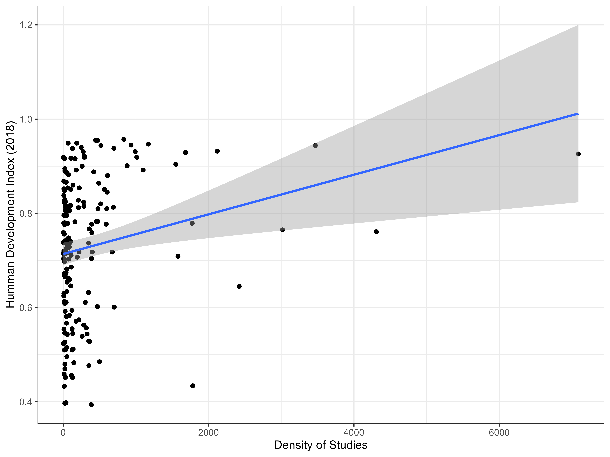
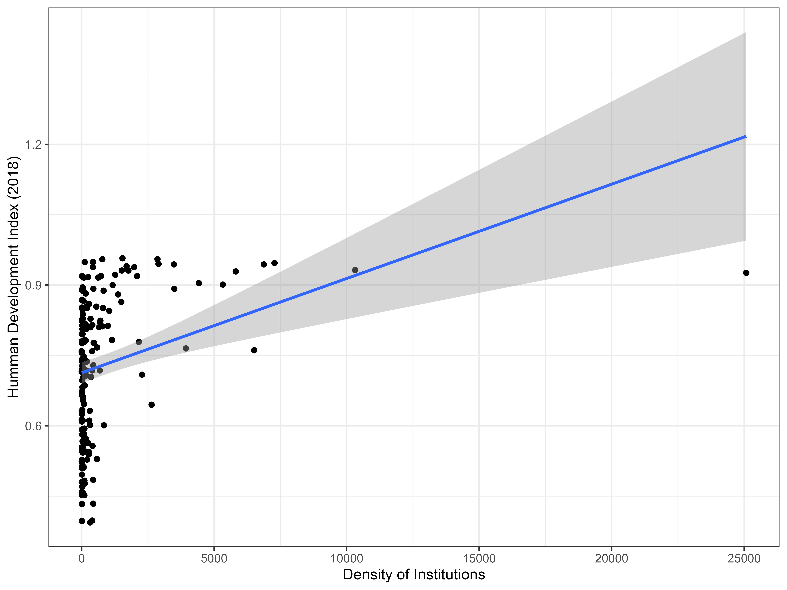
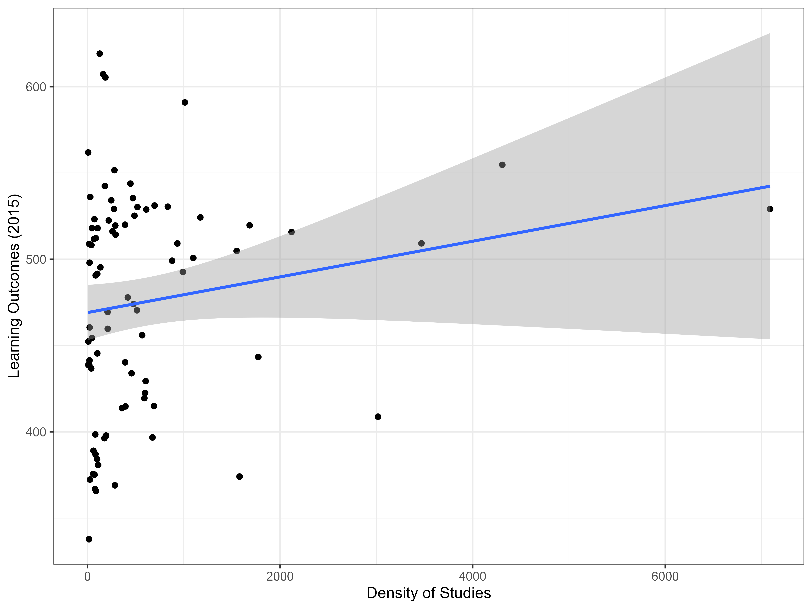
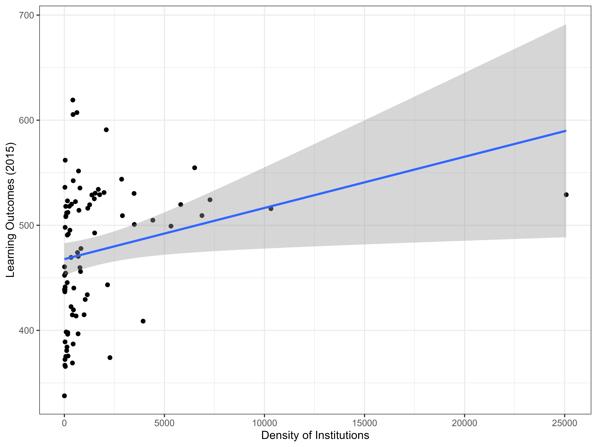
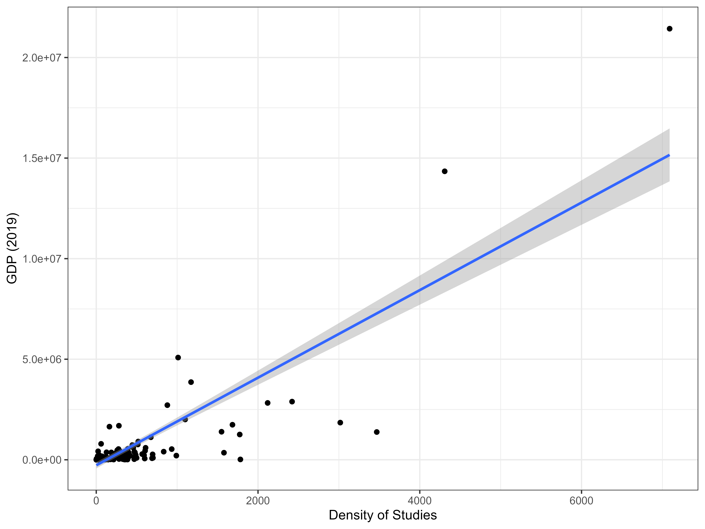
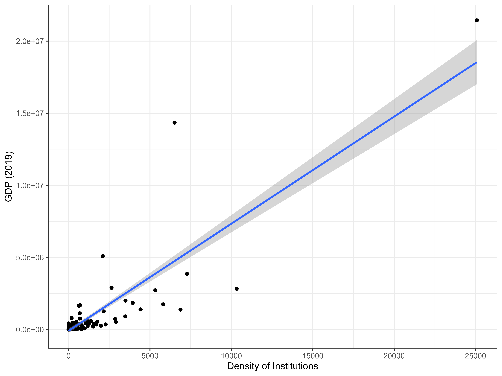
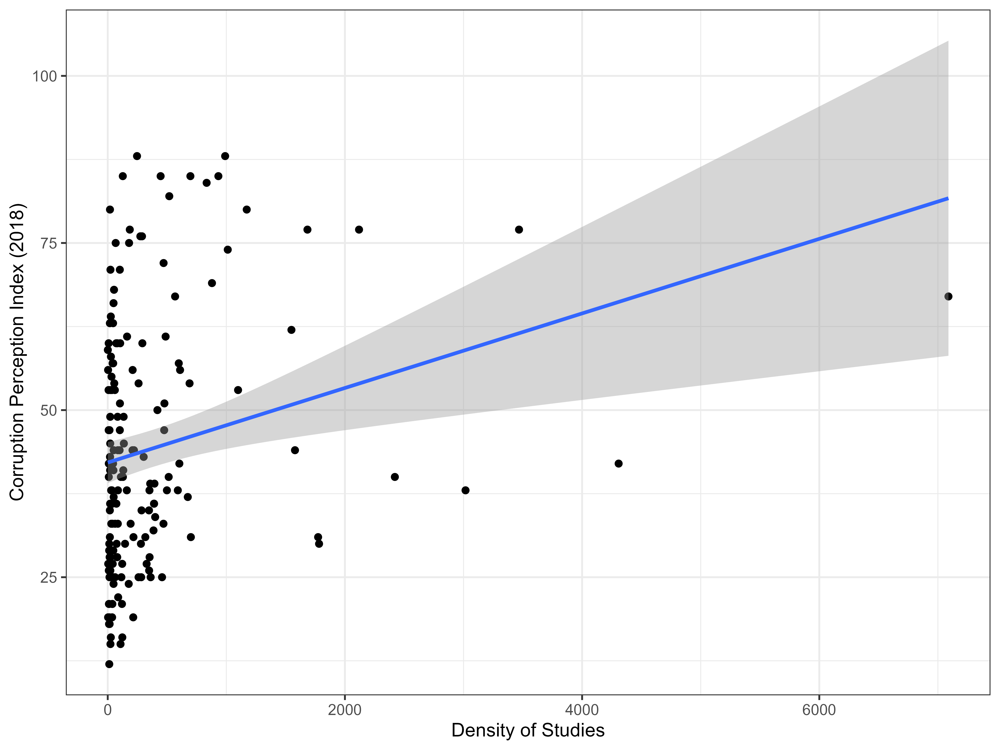
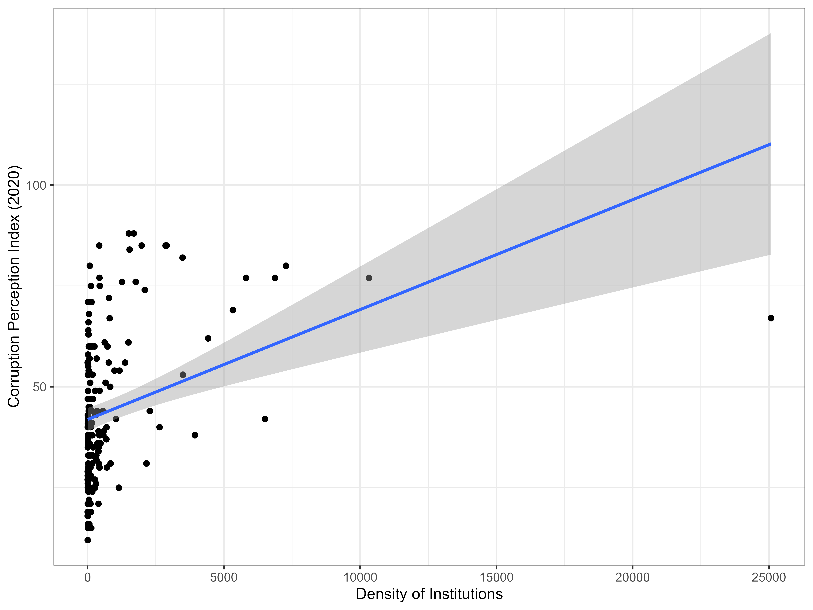

```{r setup, include=FALSE}
knitr::opts_chunk$set(echo = TRUE)
library(tidyverse)
```

# Overview {.unnumbered}

The aim was to prepare a spatio-temporal representation of valuation
studies related to biodiversity and ecosystem services and ... .

# Creation of the Corpus

# Georeferencing the Corpus
To identify country names in the corpus of literature a two step approach was used. First, we wanted to understand where studies were conducted and searched the title, abstract, and keywords of each paper for country names. Second, to understand where the funding institutions were located we searched the affiliations, acknowledgments, and funding text for country names.

The input data we used are the following:

-   Bib file downloaded from Web of Science

-   ISO 3166-1 alpha-3 country codes (https://www.iso.org/iso-3166-country-codes.html)

-   IPBES regional and subregional area dataset
    (<https://doi.org/10.5281/zenodo.3923633>)

The python code used to georeference the corpus can be found
[here](https://github.com/ellentatia/Pilot_case2). An overview of the
pipeline is provided in the following schematic and described below.

```{r overview-fig, fig.align = 'center', out.width="75%", fig.cap = "Overview of the process of Georeferencing the corpus of valuation studies"}
knitr::include_graphics("pilot2.svg")
```

Step 1: Extract country names from text
Country names were extracted from the title, abstract, and keywords of each paper with a regular expression and the associated ISO code was added into a a column in the dataset. The same regular expression was also used to search the affiliations, acknowledgments, and funding text of the same paper and placed into a second column. 

Step 2 and 3: Bundle countries in regions 
The IPBES Regions and Subregions datatset was then used to add additional region and subregion attributes to the dataset by matching the ISO3 code.  

Step 4: Find TS accordingly 
Finally, we used a set of files to add additional attributes to the dataset that identified the topics. The set of files contained identifying information for papers derived from sets of web of science searches targeting particular topics. This identifying information was then matched to the corpus, and the topic extracted. 

Finally, the complete corpus with the added attributes of country ISO codes of both funding institutions and research locations, and topic identification were used as the basis of the rest of the research project. 

# Indicator Analysis

The [IPBES Core Indicators](https://doi.org/10.5281/zenodo.4439411) were
used alongside a chosen set of other relevant indicators to understand
geographic trends between the density of studies and density of
institutes.

## Selection of Indicators

### IPBES Core Indicators

We used all the most recent year of the IPBES Core Indicators available
within the [country dataset](https://doi.org/10.5281/zenodo.4439411)
except for two indicators, Countries/Regions with Active NBSAP and
Category 1 nations in CTIES, as these are binary in the dataset and
would not be compatible with the following analysis. We selected a
specific category from the indicators with multiple categories. For
example, for the indicator "Area of forest production under FSC and PEFC
certification" we chose the FSC certification area and not the PEFC
certification area.

Here is the table of all of the IPBES Core Indicators used, the category
selected, the year the data is from, and the number assigned to them.

```{r, echo = F}
Name <- c("Area of forest production under FSC and PEFC certification",
          "Biodiversity Habitat Index",
          "Biodiversity Intactness Index",
          "Biocapacity per capita",
          "Ecological Footprint per capita",
          "Forest area",
          "Water Footprint",
          "Inland Fishery Production",
          "Region-based Marine Trophic Index",
          "Nitrogen + Phosphate Fertilizers",
          "Nitrogen Use Efficiency (%)",
          "Percentage and total area covered by protected areas",
          "Percentage of undernourished people",
          "Proportion of local breeds, classified as being at risk, not-at-risk or unknown level of risk of extinction",
          "PA of Key Biodiversity Areas Coverage (%)",
          "Protected area management effectiveness",
          "Protected Area Connectedness Index",
          "Species Habitat Index",
          "Species Protection Index (%)",
          "Species Status Information Index",
          "Total Wood Removals (roundwood, m3)",
          "Trends in forest extent (tree cover)",
          "Nitrogen Deposition Trends (kg N/ha/yr)",
          "Trends in Pesticides Use")

Category <- c("FSC_area", 
              "Average",
              "Value",
              "Value - Total",
              "Value - Total",
              "Forest area (1000ha)",
              "Water Footprint - Total (Mm3/y)",
              "Capture",
              "1950",
              "N total nutrients - Consumption in nutrients",
              "Nitrogen Use Efficiency (%)",
              "Terrestrial - Protected Area (%)",
              "Prevalence of undernourishment (%) (3-year average)",
              "At Risk of Extinction",
              "Estimate",
              "PA Assessed on Management Effectiveness (%)",
              "Protected Area Connectedness Index",
              "Species Habitat Index",
              "Species Protection Index (%)",
              "Value",
              "Total",
              "Percentage of Tree Cover Loss",
              "Nitrogen Deposition Trends (kg N/ha/yr)",
              "Use of pesticides (3-year average)")

Year <- c(2016, 
          2014,
          2005,
          2012,
          2012,
          2015,
          2013,
          2015,
          2014,
          2014,
          2009,
          2017,
          2015,
          2016,
          2016,
          2015,
          2012,
          2014,
          2014,
          2014,
          2014,
          2015,
          2030,
          2013)

Number <- c(1:11, 13, 15:26)

indicator_table <- data.frame(Name, Category, Year, Number)

indicator_table %>% 
  knitr::kable(caption = "Table 1: Details of the IPBES Core Indicators Used") %>% 
  kableExtra::kable_styling(bootstrap_options = "striped", full_width = FALSE, position = "left")
```

There were a few instances of duplicated values which were double
checked with the original dataset and the erranous value removed.
Examples include having two values for USA due to the separation of
Hawaii in the original dataset. In these cases Hawaii was removed and
the value referring to the rest of the states of the country was used
instead. Additionally, Indicator 9, Region-based Marine Trophic Index,
the mean of the regions was calculated per country, as countries such as
Germany have multiple regions with distinct values.

### Other Indicators
A set of other indicators were included in the analysis to expand the coverage of socioeconomic variables. We included the [human development index (HDI)](http://hdr.undp.org/en/indicators/137506#), [average harmonized learning outcomes score](https://ourworldindata.org/grapher/learning-outcomes-vs-gdp-per-capita), [gross domestic product (GDP)](http://www.fao.org/faostat/en/#data/MK), [corruption perception index (CPI)](https://www.transparency.org/en/cpi/2020/index/nzl), and [population](http://www.fao.org/faostat/en/#data/OA). 

These datasets were downloaded, cleaned, and had ISO3 codes added to easily merge them into the analysis. The latest data available was used for each indicator. 

## Dataset Compilation

To understand how valuation is spread across geographies, we counted the number of times each country's ISO code appeared in the corpus for both geography columns added in step 2. The result is the density of studies per country and the density of funding institutions per country for the entire corpus. 

The external indicators were also joined onto the dataset to analyze the relationships between these socioeconomic indicators and the density of studies and funding institutions. 

The uptake dataset was filtered based on a set of queries listed and explained below. We also calculated the number of times each country's ISO code appeared with the filtered dataset and joined the external indicators.  

-   Q6
-   Q8
-   Q13
-   Q6 OR Q8 OR Q13
-   Q2 ES Valuation
-   Q4 
-   Q8 AND Q13
-   Q8 OR Q13

This process was also repeated with an additional filter that excluded any studies published before 2010.   
  
## Trends Analysis {.tabset .tabset-pills}

The trend between each indicator and the density of studies and funding institutions are shown here for the entire corpus. 

### IPBES Core Indicators vs. Density of studies {.unnumbered}
```{r, fig.align = 'center', out.width="75%", fig.cap = "IPBES Core Indicators vs. Density of studies "}
knitr::include_graphics("Outputs/Corpus/Correlation25_Names1.png")
```

```{r, fig.align = 'center', out.width="75%", fig.cap = "IPBES Core Indicators vs. Log density of studies "}
knitr::include_graphics("Outputs/Corpus/Correlation25_Names1_log.png")
```
### IPBES Core Indicators vs. Density of funding institutions {.unnumbered}
```{r, fig.align = 'center', out.width="75%", fig.cap = "IPBES Core Indicators vs. Density of funding institutions"}
knitr::include_graphics("Outputs/Corpus/Correlation25_Names2.png")
```
  
```{r, fig.align = 'center', out.width="75%", fig.cap = "IPBES Core Indicators vs. Log density of funding institutions"}
knitr::include_graphics("Outputs/Corpus/Correlation25_Names2_log.png")
```
  
### Human Development Index {.unnumbered}
```{r, fig.align = 'center', out.width="75%", fig.cap = "HDI vs. Density of Studies and Institutions"}


```
  
### Learning Outcomes {.unnumbered}
```{r, fig.align = 'center', out.width="75%", fig.cap = "Learning outcomes vs. Density of Studies and Institutions"}


```
  
### GDP {.unnumbered}
```{r, fig.align = 'center', out.width="75%", fig.cap = "GDP vs. Density of Studies and Institutions"}


```
### Corruption Perception Index {.unnumbered}
```{r, fig.align = 'center', out.width="75%", fig.cap = "Corruption Percepation Index vs. Density of Studies and Institutions"}


```
  
## Pearson Correlations

To summarize this analysis more concisely, we ran a pearson correlation to understand the relationship between the number of studies filtered by _____ and each of the indicators. The results are shown below. 
```{r pearson, fig.align = 'center', fig.cap = "Pearson correlations of geographic valuation studies and indicators"}
knitr::include_graphics("Outputs/Pearson_correlation_table/correlation_figure.png")
```

```{r pearson-log, fig.align = 'center', fig.cap = "Pearson correlations of log geographic valuation studies and the indicators"}
knitr::include_graphics("Outputs/Pearson_correlation_table/correlation_figure_log.png")
```